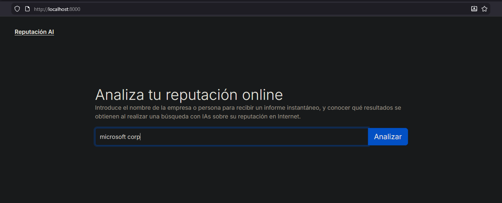
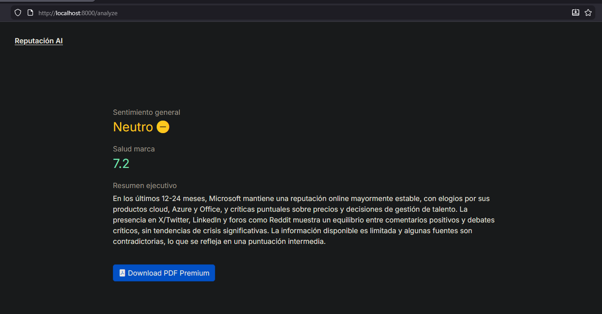
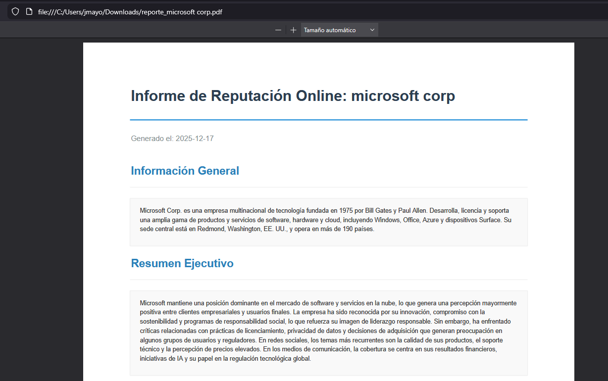

[](README.es.md)

[](https://opensource.org/licenses/Apache-2.0)
[](https://shields.io/)

# Reputation AI

Advanced reputation analysis and brand monitoring tool based on Artificial Intelligence.

## General Description

This application allows you to enter the name of a company or person to obtain a detailed analysis of their online presence. The system uses language models (LLMs) to process information and returns key metrics such as general sentiment, brand health score, and an executive summary. Additionally, it offers the ability to generate exportable PDFs for corporate reports.

## Demo and Screenshots

To see the application in action, please refer to the following screenshots:

### Analysis Panel

*Screenshot of the analysis panel where the user introduces the entity to analyze.*

### Quick Report

*Screenshot of the quick report with general sentiment analysis, brand health score, and an executive summary.*

### Generated PDF Report

*Example of the executive report generated in PDF format.*

### Download Example Generated PDF Report

*Example of the executive report generated in PDF format of the Microsoft Corp.*

## Previous Requirements

Before deploying the application, it is necessary to configure the environment variables for access to the language model API.

### Environment Configuration (.env)

Create a `.env` file in the `mysite/` directory with the following credentials. You can obtain your free API Key at [Groq Console](https://console.groq.com/).

```bash
# mysite/.env
GROQ_API_KEY=gsk_...
```

**Note:** Ensure that the model `openai/gpt-oss-120b` (or the one configured in `services.py`) is available in your account.

## Deploy with Docker (Containerization)

This project is fully "dockerized" to facilitate its deployment and orchestration.

### Construction and Execution

To raise the complete environment (build & run), use Docker Compose. This command will build the optimized image and run the container exposing the service on port `8000`.

```bash
docker-compose up --build
```

### Services

- **Web**: Django application accessible at `http://localhost:8000`.

## Project Structure

- `mysite/`: Django application source code.
- `mysite/Dockerfile`: Container image definition (based on Python Slim).
- `mysite/docker-compose.yml`: Service orchestration.

### My Background
Senior developer (20+ years PHP/MySQL) transitioning to AI/ML.
👔 Open to remote AI/ML roles in European consultancies
📧 Contact: hola@josemayor.dev | LinkedIn: https://www.linkedin.com/in/josemayor-ai-ml-developer/
